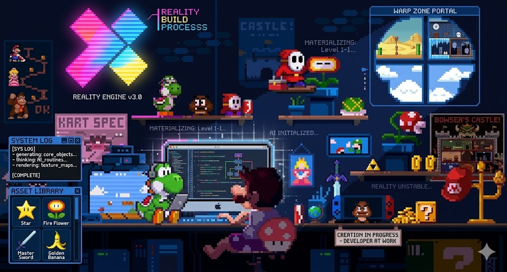

<h1 align="center">Hi , I'm Vijay Gottipati</h1>
<h3 align="center">Building production AI agents and LLM systems</h3>

  

## About Me

MS Computer Science student at New York University specializing in agentic AI systems and LLM orchestration.

2+ years of experience building production-grade AI systems with LangChain, LangGraph, PyTorch, and Hugging Face, deployed on AWS, Docker, and GCP. Skilled in end-to-end ML systems including fine-tuning, distributed deployment, and vector database optimization.

- 🔭 I’m currently working on **GraphRAG memory and skills**
- 🌱 I’m currently learning **advanced multi-agent orchestration, LLM evaluation systems, and production-grade RAG architectures**
- 💬 Ask me about **agentic AI, LLM orchestration, RAG systems, transformers, and production ML pipelines**

## Education

- **New York University, New York, NY**  
  Master of Science in Computer Science, CGPA: **3.45/4.0**  
  *Sep 2024 - May 2026 (Expected)*

- **Birla Institute of Technology and Science, Pilani - Dubai, UAE**  
  Bachelor of Engineering in Computer Science, CGPA: **3.5/4.0**  
  *Sep 2019 - Jul 2023*

## Skills and Technologies

- **Programming Languages & Frameworks:** Python, SQL, JavaScript, TypeScript, Django, FastAPI
- **ML/AI Frameworks:** PyTorch, TensorFlow, Scikit-learn, Hugging Face, LangChain, LangGraph
- **MLOps & Cloud:** AWS, Kubernetes, Docker, PostgreSQL, MongoDB, Redis, Kafka
- **Databases & Data Systems:** MongoDB, PostgreSQL, Spark, BigQuery
- **Web & Tools:** React, Node.js, FastAPI, CI/CD Pipelines, Git, vLLM

## Featured Projects

- **Autonomous DevOps Copilot** - `LangGraph`, `Gemini 1.5 Flash`, `Django`, `AWS SQS`, `PostgreSQL (pgvector)`, `Angular` - *Dec 2025*
  - Cut manual triage time by 30% by building an autonomous DevOps copilot processing 100+ daily GitHub/Slack alerts with multi-agent LLM workflows (LangGraph + Gemini).
  - Scaled real-time event processing to ~5K+ events/min with <200ms latency using an AWS SQS-backed async architecture, improving system reliability under bursty webhook loads.
  - Increased developer velocity by auto-generating code fixes and opening PRs via agent-driven CI/CD workflows; implemented human-in-the-loop approvals, achieving high merge acceptance rates (~70-80%).
  - Engineered persistent agent memory and semantic context retrieval using pgvector (Neon PostgreSQL), reducing decision latency by ~40% and enabling context-aware automation via a real-time Angular dashboard.

- **CityLens** - `Gemini Live`, `FastAPI`, `Vite`, `React Native`, `Google Maps API`, `Firestore`, `GCP` - *Jan 2026*
  - Increased recruiter engagement by 25% by optimizing a React Native interface to a 98/100 Lighthouse score, improving performance and SEO.
  - Built a FastAPI-based location intelligence system integrating Google Maps APIs (places, geocoding, directions) with Firestore session context, enabling real-time navigation, visual assistance, and live environmental insights across multiple interaction modes.

- **Real-Time Financial Fraud Explainer** - `LangChain`, `Kafka (AWS MSK)`, `AWS Bedrock AgentCore`, `Lenses.io` - *New York, NY*  
  **2nd Place / 25 teams - Lenses.io Real-Time Data & AI Hackathon (Oct 2025)**
  - Built a real-time fraud detection pipeline processing streaming transactions via Kafka (MSK), enabling instant detection of anomalous credit-card/PayPal activity.
  - Designed a 3-agent (Detection-Context-Explainer) LLM system producing interpretable fraud insights, improving explainability of flagged events.
  - Enabled low-latency stream observability and agent-triggered reasoning using Lenses.io MCP, supporting real-time anomaly propagation across pipelines.

- **AI-Powered Shopping Automation System** - `Python`, `Browser Use`, `DeepL API` - *New York, NY, AI Tinkerer Hackathon (Nov 2025)*
  - Automated end-to-end grocery purchasing by building an agent pipeline that ingests lists from Google Docs/Notion and executes checkout via browser automation (Instacart/Target).
  - Processed multilingual inputs using DeepL API and structured extraction workflows, improving accuracy of item/quantity parsing across heterogeneous sources.
  - Orchestrated modular agents (ingestion-translation-execution) with Manus, enabling secure, scalable automation with OAuth-based integrations.

## Personal Links

- GitHub: [github.com/VijayGottipati](https://github.com/VijayGottipati)
- LinkedIn: [vijay-gottipati](https://www.linkedin.com/in/vijay-gottipati-8a02101b0/)
- Portfolio: [vijaygottipati.vercel.app](https://vijaygottipati.vercel.app/)
- Email: `vg2571@nyu.edu`

## GitHub Statistics

  

  
  

## Trophies

  

